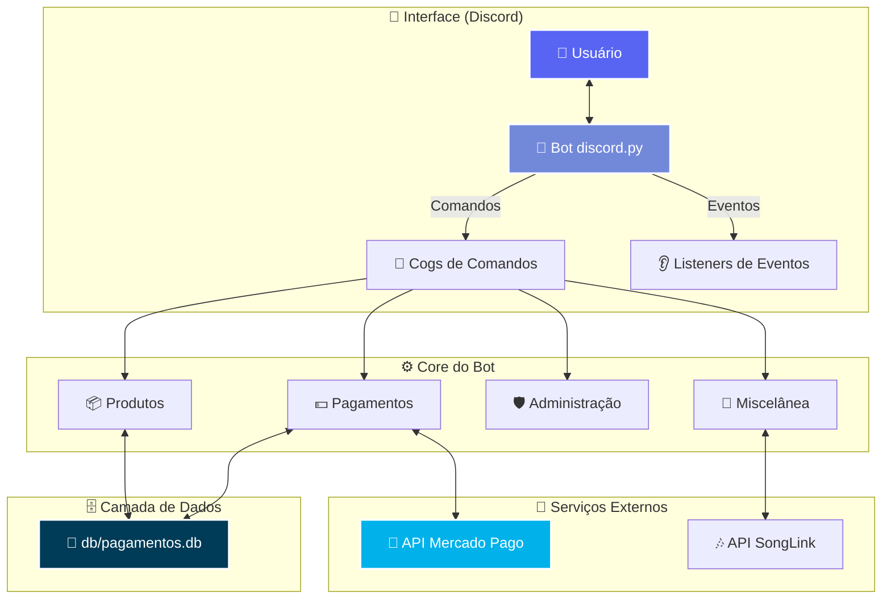

# 🤖 Mymy Bot

<div align="center">
  
</div>

## 🎬 Demonstração em Ação

<div align="center">

<br>
<em>Interface de compra interativa do Mymy Bot, construída com discord.py</em>
</div>

<br>

<div align="center">
<table border="0" cellpadding="10">
<tr align="center">
<td><br><sub><b>1. Seleção de Produto</b></sub></td>
<td><br><sub><b>2. Recebimento do produto</b></sub></td>
<td><br><sub><b>3. Comandos de administração</b></sub></td>
<td><br><sub><b>4. Logs automaticos</b></sub></td>
</tr>
</table>
</div>

## 🚀 Sobre o Projeto


**Mymy Bot** é um bot para Discord robusto e completo, projetado para automatizar todo o ciclo de vendas de produtos digitais, como keys de software. Ele oferece uma experiência de compra fluida para os usuários e ferramentas de gerenciamento poderosas para os administradores.

### 🛠️ Tecnologias Principais

- **discord.py** - Interação total com a API do Discord
- **Mercado Pago SDK** - Integração nativa para pagamentos PIX
- **aiosqlite** - Banco de dados assíncrono e eficiente
- **Estrutura de Cogs** - Código modular e organizado

> 🎯 **A automação é o pilar deste projeto, permitindo que a loja funcione 24/7 sem intervenção manual!**

## ✨ Funcionalidades Principais

<div align="center">

| 🛒 **Automação de Vendas** | 📦 **Gerenciamento de Estoque** | 🛡️ **Administração** | ⚙️ **Utilitários** |
|:------------------------:|:------------------------------:|:-------------------:|:-----------------:|
| Menus Interativos | CRUD de Produtos | Comandos Exclusivos | Comandos Úteis |
| Geração de PIX Automática | Controle de Estoque | Sistema de Permissões | Templates de Embeds |
| Verificação em Tempo Real | Adição de Keys em Massa | Logs Completos | Tratamento de Erros |
| **Entrega Automática na DM** | Consulta de Keys | Avisos Customizados | Tradução de URLs |

</div>

## 🔄 Fluxo de Funcionamento

```mermaid
graph TB
    A[🚀 Usuário] --> B[🛒 Acessa Menu de Compra]
    B --> C[📋 Seleciona Menu/Categoria]
    C --> D[📦 Escolhe Submenu/Produto]
    D --> E[🎫 Abre Ticket de Compra]
    E --> F[💵 Clica em "Gerar PIX"]
    F --> G{🤖 Bot gera QR Code<br/>e Código PIX com Valor}
    G --> H[💳 Usuário realiza o pagamento]
    H --> I{🔍 Bot verifica o<br/>pagamento via API}
    I -- Aprovado --> J[🔑 **ENVIO AUTOMÁTICO**<br/>Bot busca Key no DB<br/>e envia na DM]
    J --> K[✅ Ticket é fechado<br/>conforme tempo definido]
    I -- Pendente/Erro --> L[⏳ Aguarda ou informa o erro]
    
    style A fill:#5865F2,stroke:#fff,stroke-width:2px,color:#fff
    style I fill:#00B1EA,stroke:#fff,stroke-width:2px,color:#fff
    style J fill:#2ecc71,stroke:#fff,stroke-width:2px,color:#fff
```

<details>
<summary><b>📋 Clique para ver o Passo a Passo Detalhado</b></summary>

1. **🛒 Início**: O administrador usa `/menu_compra` para exibir o painel de vendas.
2. **🖱️ Navegação**: O usuário navega pelos menus e submenus organizados hierarquicamente.
3. **📦 Seleção**: O usuário escolhe o produto desejado dentro do submenu específico.
4. **🎫 Ticket**: Um canal de ticket privado é criado automaticamente para o usuário e a staff.
5. **💵 Pagamento**: Dentro do ticket, o usuário clica no botão para gerar o pagamento PIX com o valor configurado.
6. **🤖 Automação**: O bot se comunica com o Mercado Pago e exibe o QR Code e o código "copia e cola".
7. **🔍 Verificação**: O bot monitora o status do pagamento em tempo real.
8. **🔑 Entrega Automática**: Assim que o pagamento é aprovado, o bot **automaticamente** busca uma key válida no banco de dados (usando produto_id) e a envia na mensagem direta (DM) do usuário.
9. **✅ Finalização**: O bot envia uma confirmação no ticket e o fecha conforme o tempo de entrega configurado.

</details>

## 🏗️ Arquitetura do Sistema



## 📦 Estrutura do Projeto

```
📁 Mymy-Bot/
├── 🐍 main.py                 # Ponto de entrada do bot
├── 📁 cogs/
│   ├── 🛡️ administracao.py    # Comandos de administração
│   ├── 🛒 menu_compra.py      # Lógica do menu de compras e tickets
│   ├── 🎵 misc.py             # Comandos diversos
│   ├── 💵 pagamentos.py       # Integração com Mercado Pago
│   └── 📦 produtos.py         # Gerenciamento de produtos e keys
├── 📁 core/
│   ├── 👑 administracao.py    # Funções de verificação de permissão
│   └── ⚙️ sistema_config.py   # Configurações de canais e categorias
├── 📁 db/
│   ├── 📝 database.py         # Funções de interação com o banco de dados
│   └── 🗄️ pagamentos.db       # Banco de dados SQLite
├── 📁 template/
│   └── 🎨 embed.py            # Templates de embeds padronizados
├── 📁 config/
│   └── 🔑 .env                # Arquivo para credenciais e tokens
├── 📋 requirements.txt        # Dependências Python
└── 📖 README.md               # Esta documentação
```

## ⚡ Instalação e Configuração

### 📋 Pré-requisitos

- **Python 3.10+**
- **Git**
- **🤖 Conta de Desenvolvedor Discord**
- **💳 Conta no Mercado Pago**

### 🚀 Instalação em 4 Passos

```bash
# 1️⃣ Clone o repositório
git clone https://github.com/Ansbach-0/Mymy-Bot.git
cd Mymy-Bot

# 2️⃣ Instale as dependências
pip install -r requirements.txt

# 3️⃣ Configure as variáveis de ambiente
# Crie um arquivo .env dentro da pasta 'config/'

# 4️⃣ Execute o bot
python main.py
```

### 🔧 Configuração do Ambiente (config/.env)

```env
# Token do seu bot do Discord
TOKEN_DISCORD="SEU_TOKEN_AQUI"

# Access Token do Mercado Pago
MERCADO_PAGO_ACCESS_TOKEN="SEU_ACCESS_TOKEN_AQUI"

# ID do seu servidor (guild) do Discord
GUILD_ID=SEU_ID_DE_SERVIDOR_AQUI

# ID do cargo de administrador
ADMIN_ROLE_ID=ID_DO_CARGO_ADMIN_AQUI
```

## 🎮 Como Usar

### 👑 Comandos de Administrador

| Comando | Descrição | Exemplo de Uso |
|---------|-----------|----------------|
| `/criar_produto` | Cria um produto com menu, submenu, valor e tempo de entrega. | `/criar_produto menu:"Jogos" submenu:"Minecraft" valor:25.99 tempo:"Instantâneo"` |
| `/adicionar_keys` | Adiciona keys via arquivo .txt enviado no Discord. | `/adicionar_keys produto_id:1 keys:[arquivo.txt]` |
| `/menu_compra` | Envia o painel de compras no canal. | `/menu_compra` |
| `/aviso` | Envia um aviso customizado. | `/aviso titulo:"Manutenção" msg:"Em 10min"` |
| `/enviar_key` | **⚠️ APENAS para correções manuais** - Envia key quando há falhas no sistema automático. | `/enviar_key usuario:@user produto:"Minecraft"` |

> **🔥 IMPORTANTE**: O sistema de entrega é **100% automático**! O comando `/enviar_key` existe apenas como backup para situações excepcionais onde o envio automático falhar por algum erro técnico.

### 🛒 Fluxo do Usuário

1. **Encontre** o canal com o menu de compras.
2. **Navegue** pelos menus organizados por categoria.
3. **Selecione** um submenu específico do produto desejado.
4. **Aguarde** a abertura do ticket privado automático.
5. **Clique** em "Gerar PIX" dentro do ticket.
6. **Pague** o valor configurado via QR Code ou código PIX.
7. **Receba automaticamente** sua key por mensagem direta conforme o tempo de entrega!

### 🚀 Sistema de Entrega Automática

O **Mymy Bot** foi projetado para funcionar de forma **completamente automatizada**:

- ✅ **Detecção automática**: O bot monitora pagamentos em tempo real
- ✅ **Busca automática**: Localiza automaticamente uma key válida no estoque
- ✅ **Envio automático**: Entrega a key diretamente na DM do usuário
- ✅ **Confirmação automática**: Notifica sobre a entrega e fecha o ticket
- ✅ **Logs automáticos**: Registra toda a transação para auditoria

**Nenhuma intervenção manual é necessária!** O sistema funciona 24/7.

### 📊 Estrutura de Produtos

O sistema organiza os produtos de forma hierárquica:

```
📋 Menu (Categoria Principal)
└── 📦 Submenu (Produto Específico)
    ├── 💰 Valor (Preço configurado)
    ├── ⏱️ Tempo (Tempo de entrega)
    └── 🔑 Keys (Armazenadas por produto_id)
```

**Exemplo prático:**
- **Menu**: "Jogos"
- **Submenu**: "Minecraft Premium"
- **Valor**: R$ 25,99
- **Tempo**: "Instantâneo"
- **Keys**: Carregadas via arquivo .txt

## 🛠️ Stack Tecnológica

<div align="center">

| Tecnologia | Versão/SDK | Função |
|:----------:|:----------:|:-------|
|  | 3.10+ | Linguagem principal |
|  | 2.3+ | Interação com a API do Discord |
|  | 2.1.2+ | Gateway de Pagamento PIX |
|  | 0.17+ | Banco de Dados Assíncrono |
|  | 3.8+ | Requisições HTTP Assíncronas |

</div>

## 📊 Roadmap

| Status | Funcionalidade |
|:------:|:---------------|
| ✅ | Sistema básico de vendas com tickets |
| ✅ | Integração completa com Mercado Pago PIX |
| ✅ | Entrega automática de keys e logs |
| 🔄 | Dashboard web para administração |
| 💡 | Integração com outros gateways de pagamento |
| 💡 | Sistema de cupons de desconto |
| 💡 | Relatórios de vendas avançados |
| 💡 | API REST para integrações externas |

## 📄 Licença

Distribuído sob a **Licença MIT**. Veja `LICENSE` para mais informações.

> MIT License - Copyright (c) 2024 Vinícius Ansbach Costa

## 👨‍💻 Desenvolvedor

<div align="center">
  
  <br><br>
  <h3>Vinícius Ansbach Costa</h3>
  <p><em>Desenvolvedor Python & Entusiasta de Automação</em></p>
  
  [](https://github.com/Ansbach-0)
  [](https://linkedin.com/in/vinicius-ansbach)
</div>

---

<div align="center">
  
  <br>
  <h3>⭐ Se este projeto foi útil para você, considere dar uma estrela! ⭐</h3>
  <br>
  
  <br><br>
  <em>Feito com ❤️ e muito 🧉 por Vinícius Ansbach</em>
</div>
